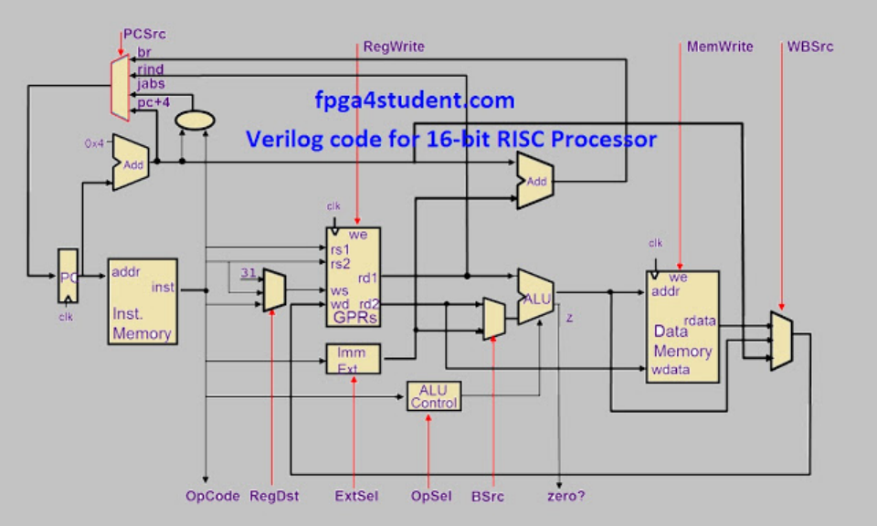
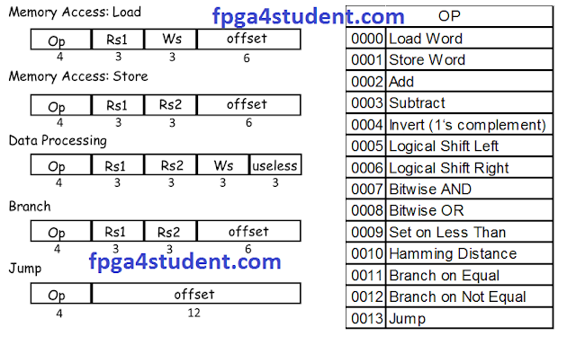

> 本文由 [简悦 SimpRead](http://ksria.com/simpread/) 转码， 原文地址 [www.fpga4student.com](https://www.fpga4student.com/2017/04/verilog-code-for-16-bit-risc-processor.html)

# 1. Verilog Code for 16-bit RISC Processor

In this Verilog project, Verilog code for a 16-bit RISC processor is presented. 
The RISC processor is designed based on its instruction set and Harvard-type data path structure. Then, the RISC processor is implemented in Verilog and verified using `Xilinx ISIM`.


<div align=center>


</div>

The instruction set of the RISC [processor](https://www.fpga4student.com/2017/01/verilog-code-for-single-cycle-MIPS-processor.html):

* A. Memory Access Instructions

|     | Memory Access Instructions | assembly            | Mean                    |
| --- | -------------------------- | ------------------- | ----------------------- |
| 1   | Load Word:                 | LD ws, offset(rs1)  | ws:=Mem16[rs1 + offset] |
| 2   | Store Word:                | ST rs2, offset(rs1) | Mem16[rs1 + offset]=rs2 |

---

* B. Data Processing Instructions
  
|     | Data Processing Instructions | assembly           | Mean                                        |
| --- | ---------------------------- | ------------------ | ------------------------------------------- |
| 1   | Add:                         | `ADD ws, rs1, rs2` | ws:=rs1 + rs2                               |
| 2   | Subtract:                    | `SUB ws, rs1, rs2` | ws:=rs1 – rs2                               |
| 3   | Invert (1‘s complement):     | `INV ws, rs1     ` | ws:=!rs1                                    |
| 4   | Logical Shift Left:          | `LSL ws, rs1, rs2` | ws:=rs1 << rs2                              |
| 5   | Logical Shift Right:         | `LSR ws, rs1, rs2` | ws:=rs1 >> rs2                              |
| 6   | Bitwise AND:                 | `AND ws, rs1, rs2` | ws:=rs1 • rs2                               |
| 7   | Bitwise OR:                  | `OR ws, rs1, rs2 ` | ws:=rs1 \| rs2                              |
| 8   | Set on Less Than:            | `SLT ws, rs1, rs2` | ws:=1 if rs1 < rs2; <br> ws:=0 if rs1 ≥ rs2 |

---

* C. Control Flow Instructions

|     |                      |                      |                                                    |
| --- | -------------------- | -------------------- | -------------------------------------------------- |
| 1   | Branch on Equal:     | BEQ rs1, rs2, offset | Branch to (PC + 2 + (offset << 1)) when rs1 = rs2  |
| 2   | Branch on Not Equal: | BNE rs1, rs2, offset | Branch to (PC + 2 + (offset << 1)) when rs1 != rs2 |
| 3   | Jump:                | JMP offset           | Jump to {PC [15:13], (offset << 1)}                |


Instruction Format of the RISC processor :
<div align=center>

[See file Control_Unit.v](Control_Unit.v)

</div>

* Processor Control Unit Design:
  
  Control signals

| Instruction     | RegDst | ALU Src | Memto Reg | Reg Write | Mem Read | Mem Write | Branch | ALUOp | Jump |
| --------------- | ------ | ------- | --------- | --------- | -------- | --------- | ------ | ----- | ---- |
| Data-processing | 1      | 0       | 0         | 1         | 0        | 0         | 0      | 0     | 0    |
| LW              | 0      | 1       | 1         | 1         | 1        | 0         | 0      | 10    | 0    |
| SW              | 0      | 1       | 0         | 0         | 0        | 1         | 0      | 10    | 0    |
| BEQ,BNE         | 0      | 0       | 0         | 0         | 0        | 0         | 1      | 1     | 0    |
| J               | 0      | 0       | 0         | 0         | 0        | 0         | 0      | 0     | 1    |

---

* ALU Control Unit Design:

| ALU Control |             |        |               |                |
| ----------- | ----------- | ------ | ------------- | -------------- |
| ALUOp       | Opcode(hex) | ALUcnt | ALU Operation | Instruction    |
| 10          | xxxx        | 0      | ADD           | LW,SW          |
| 1           | xxxx        | 1      | SUB           | BEQ,BNE        |
| 0           | 2           | 0      | ADD           | D-type: ADD    |
| 0           | 3           | 1      | SUB           | D-type: SUB    |
| 0           | 4           | 10     | INVERT        | D-type: INVERT |
| 0           | 5           | 11     | LSL           | D-type: LSL    |
| 0           | 6           | 100    | LSR           | D-type: LSR    |
| 0           | 7           | 101    | AND           | D-type: AND    |
| 0           | 8           | 110    | OR            | D-type: OR     |
| 0           | 9           | 111    | SLT           | D-type: SLT    |

# 2. 代码

## 2.1. Verilog code for Instruction Memory :
```verilog
`include "Parameter.v"
// fpga4student.com 
// FPGA projects, VHDL projects, Verilog projects 
// Verilog code for RISC Processor 
// Verilog code for Instruction Memory
module Instruction_Memory(
 input[15:0] pc,
 output[15:0] instruction
);

 reg [`col - 1:0] memory [`row_i - 1:0];
 wire [3 : 0] rom_addr = pc[4 : 1];
 initial
 begin
  $readmemb("./test/test.prog", memory,0,14);
 end
 assign instruction =  memory[rom_addr]; 

endmodule
```
## 2.2. Verilog code for [register file](https://www.fpga4student.com/2017/01/basic-digital-blocks-in-verilog.html):

```verilog
`timescale 1ns / 1ps
// fpga4student.com 
// FPGA projects, VHDL projects, Verilog projects 
// Verilog code for RISC Processor 
// Verilog code for register file
module GPRs(
 input    clk,
 // write port
 input    reg_write_en,
 input  [2:0] reg_write_dest,
 input  [15:0] reg_write_data,
 //read port 1
 input  [2:0] reg_read_addr_1,
 output  [15:0] reg_read_data_1,
 //read port 2
 input  [2:0] reg_read_addr_2,
 output  [15:0] reg_read_data_2
);
 reg [15:0] reg_array [7:0];
 integer i;
 // write port
 //reg [2:0] i;
 initial begin
  for(i=0;i<8;i=i+1)
   reg_array[i] <= 16'd0;
 end
 always @ (posedge clk ) begin
   if(reg_write_en) begin
    reg_array[reg_write_dest] <= reg_write_data;
   end
 end
 

 assign reg_read_data_1 = reg_array[reg_read_addr_1];
 assign reg_read_data_2 = reg_array[reg_read_addr_2];


endmodule
```

## 2.3. Verilog code for Data Memory:

```verilog
`include "Parameter.v"
// fpga4student.com 
// FPGA projects, VHDL projects, Verilog projects 
// Verilog code for RISC Processor 
// Verilog code for data Memory
module Data_Memory(
 input clk,
 // address input, shared by read and write port
 input [15:0]   mem_access_addr,
 
 // write port
 input [15:0]   mem_write_data,
 input     mem_write_en,
 input mem_read,
 // read port
 output [15:0]   mem_read_data
);

reg [`col - 1:0] memory [`row_d - 1:0];
integer f;
wire [2:0] ram_addr=mem_access_addr[2:0];
initial
 begin
  $readmemb("./test/test.data", memory);
  
  f = $fopen(`filename);
  $fmonitor(f, "time = %d\n", $time, 
  "\tmemory[0] = %b\n", memory[0],   
  "\tmemory[1] = %b\n", memory[1],
  "\tmemory[2] = %b\n", memory[2],
  "\tmemory[3] = %b\n", memory[3],
  "\tmemory[4] = %b\n", memory[4],
  "\tmemory[5] = %b\n", memory[5],
  "\tmemory[6] = %b\n", memory[6],
  "\tmemory[7] = %b\n", memory[7]);
  `simulation_time;
  $fclose(f);
 end
 
 always @(posedge clk) begin
  if (mem_write_en)
   memory[ram_addr] <= mem_write_data;
 end
 assign mem_read_data = (mem_read==1'b1) ? memory[ram_addr]: 16'd0; 


endmodule
```

## 2.4. Verilog code for ALU unit:

```verilog
// fpga4student.com 
// FPGA projects, VHDL projects, Verilog projects 
// Verilog code for RISC Processor 
// Verilog code for ALU
module ALU(
 input  [15:0] a,  //src1
 input  [15:0] b,  //src2
 input  [2:0] alu_control, //function sel
 
 output reg [15:0] result,  //result 
 output zero
    );

always @(*)
begin 
 case(alu_control)
 3'b000: result = a + b; // add
 3'b001: result = a - b; // sub
 3'b010: result = ~a;
 3'b011: result = a<<b;
 3'b100: result = a>>b;
 3'b101: result = a & b; // and
 3'b110: result = a | b; // or
 3'b111: begin if (a<b) result = 16'd1;
    else result = 16'd0;
    end
 default:result = a + b; // add
 endcase
end
assign zero = (result==16'd0) ? 1'b1: 1'b0;
 
endmodule
```

## 2.5. Verilog code for ALU Control Unit of the RISC processor:

```verilog
`timescale 1ns / 1ps
//fpga4student.com: FPGA projects, Verilog projects, VHDL projects
// Verilog code for 16-bit RISC processor
// ALU_Control Verilog code
module alu_control( ALU_Cnt, ALUOp, Opcode);
 output reg[2:0] ALU_Cnt;
 input [1:0] ALUOp;
 input [3:0] Opcode;
 wire [5:0] ALUControlIn;
 assign ALUControlIn = {ALUOp,Opcode};
 always @(ALUControlIn)
 casex (ALUControlIn)
   6'b10xxxx: ALU_Cnt=3'b000;
   6'b01xxxx: ALU_Cnt=3'b001;
   6'b000010: ALU_Cnt=3'b000;
   6'b000011: ALU_Cnt=3'b001;
   6'b000100: ALU_Cnt=3'b010;
   6'b000101: ALU_Cnt=3'b011;
   6'b000110: ALU_Cnt=3'b100;
   6'b000111: ALU_Cnt=3'b101;
   6'b001000: ALU_Cnt=3'b110;
   6'b001001: ALU_Cnt=3'b111;
  default: ALU_Cnt=3'b000;
  endcase
endmodule
```

## 2.6. Verilog code for Datapath of the RISC processor:

```verilog
`timescale 1ns / 1ps
// fpga4student.com 
// FPGA projects, VHDL projects, Verilog projects 
// Verilog code for RISC Processor 
// Verilog code for Data Path of the processor
module Datapath_Unit(
 input clk,
 input jump,beq,mem_read,mem_write,alu_src,reg_dst,mem_to_reg,reg_write,bne,
 input[1:0] alu_op,
 output[3:0] opcode
);
 reg  [15:0] pc_current;
 wire [15:0] pc_next,pc2;
 wire [15:0] instr;
 wire [2:0] reg_write_dest;
 wire [15:0] reg_write_data;
 wire [2:0] reg_read_addr_1;
 wire [15:0] reg_read_data_1;
 wire [2:0] reg_read_addr_2;
 wire [15:0] reg_read_data_2;
 wire [15:0] ext_im,read_data2;
 wire [2:0] ALU_Control;
 wire [15:0] ALU_out;
 wire zero_flag;
 wire [15:0] PC_j, PC_beq, PC_2beq,PC_2bne,PC_bne;
 wire beq_control;
 wire [12:0] jump_shift;
 wire [15:0] mem_read_data;
 // PC 
 initial begin
  pc_current <= 16'd0;
 end
 always @(posedge clk)
 begin 
   pc_current <= pc_next;
 end
 assign pc2 = pc_current + 16'd2;
 // instruction memory
 Instruction_Memory im(.pc(pc_current),.instruction(instr));
 // jump shift left 2
 assign jump_shift = {instr[11:0],1'b0};
 // multiplexer regdest
 assign reg_write_dest = (reg_dst==1'b1) ? instr[5:3] :instr[8:6];
 // register file
 assign reg_read_addr_1 = instr[11:9];
 assign reg_read_addr_2 = instr[8:6];

 // GENERAL PURPOSE REGISTERs
 GPRs reg_file
 (
  .clk(clk),
  .reg_write_en(reg_write),
  .reg_write_dest(reg_write_dest),
  .reg_write_data(reg_write_data),
  .reg_read_addr_1(reg_read_addr_1),
  .reg_read_data_1(reg_read_data_1),
  .reg_read_addr_2(reg_read_addr_2),
  .reg_read_data_2(reg_read_data_2)
 );
 // immediate extend
 assign ext_im = {{10{instr[5]}},instr[5:0]};  
 // ALU control unit
 alu_control ALU_Control_unit(.ALUOp(alu_op),.Opcode(instr[15:12]),.ALU_Cnt(ALU_Control));
 // multiplexer alu_src
 assign read_data2 = (alu_src==1'b1) ? ext_im : reg_read_data_2;
 // ALU 
 ALU alu_unit(.a(reg_read_data_1),.b(read_data2),.alu_control(ALU_Control),.result(ALU_out),.zero(zero_flag));
 // PC beq add
 assign PC_beq = pc2 + {ext_im[14:0],1'b0};
 assign PC_bne = pc2 + {ext_im[14:0],1'b0};
 // beq control
 assign beq_control = beq & zero_flag;
 assign bne_control = bne & (~zero_flag);
 // PC_beq
 assign PC_2beq = (beq_control==1'b1) ? PC_beq : pc2;
 // PC_bne
 assign PC_2bne = (bne_control==1'b1) ? PC_bne : PC_2beq;
 // PC_j
 assign PC_j = {pc2[15:13],jump_shift};
 // PC_next
 assign pc_next = (jump == 1'b1) ? PC_j :  PC_2bne;

 /// Data memory
  Data_Memory dm
   (
    .clk(clk),
    .mem_access_addr(ALU_out),
    .mem_write_data(reg_read_data_2),
    .mem_write_en(mem_write),
    .mem_read(mem_read),
    .mem_read_data(mem_read_data)
   );
 
 // write back
 assign reg_write_data = (mem_to_reg == 1'b1)?  mem_read_data: ALU_out;
 // output to control unit
 assign opcode = instr[15:12];
endmodule
```

## 2.7. Verilog code for the Control Unit of the RISC processor:

```verilog
`timescale 1ns / 1ps
// fpga4student.com 
// FPGA projects, VHDL projects, Verilog projects 
// Verilog code for RISC Processor 
// Verilog code for Control Unit 
module Control_Unit(
      input[3:0] opcode,
      output reg[1:0] alu_op,
      output reg jump,beq,bne,mem_read,mem_write,alu_src,reg_dst,mem_to_reg,reg_write    
    );


always @(*)
begin
 case(opcode) 
 4'b0000:  // LW
   begin
    reg_dst = 1'b0;
    alu_src = 1'b1;
    mem_to_reg = 1'b1;
    reg_write = 1'b1;
    mem_read = 1'b1;
    mem_write = 1'b0;
    beq = 1'b0;
    bne = 1'b0;
    alu_op = 2'b10;
    jump = 1'b0;   
   end
 4'b0001:  // SW
   begin
    reg_dst = 1'b0;
    alu_src = 1'b1;
    mem_to_reg = 1'b0;
    reg_write = 1'b0;
    mem_read = 1'b0;
    mem_write = 1'b1;
    beq = 1'b0;
    bne = 1'b0;
    alu_op = 2'b10;
    jump = 1'b0;   
   end
 4'b0010:  // data_processing
   begin
    reg_dst = 1'b1;
    alu_src = 1'b0;
    mem_to_reg = 1'b0;
    reg_write = 1'b1;
    mem_read = 1'b0;
    mem_write = 1'b0;
    beq = 1'b0;
    bne = 1'b0;
    alu_op = 2'b00;
    jump = 1'b0;   
   end
 4'b0011:  // data_processing
   begin
    reg_dst = 1'b1;
    alu_src = 1'b0;
    mem_to_reg = 1'b0;
    reg_write = 1'b1;
    mem_read = 1'b0;
    mem_write = 1'b0;
    beq = 1'b0;
    bne = 1'b0;
    alu_op = 2'b00;
    jump = 1'b0;   
   end
 4'b0100:  // data_processing
   begin
    reg_dst = 1'b1;
    alu_src = 1'b0;
    mem_to_reg = 1'b0;
    reg_write = 1'b1;
    mem_read = 1'b0;
    mem_write = 1'b0;
    beq = 1'b0;
    bne = 1'b0;
    alu_op = 2'b00;
    jump = 1'b0;   
   end
 4'b0101:  // data_processing
   begin
    reg_dst = 1'b1;
    alu_src = 1'b0;
    mem_to_reg = 1'b0;
    reg_write = 1'b1;
    mem_read = 1'b0;
    mem_write = 1'b0;
    beq = 1'b0;
    bne = 1'b0;
    alu_op = 2'b00;
    jump = 1'b0;   
   end
 4'b0110:  // data_processing
   begin
    reg_dst = 1'b1;
    alu_src = 1'b0;
    mem_to_reg = 1'b0;
    reg_write = 1'b1;
    mem_read = 1'b0;
    mem_write = 1'b0;
    beq = 1'b0;
    bne = 1'b0;
    alu_op = 2'b00;
    jump = 1'b0;   
   end
 4'b0111:  // data_processing
   begin
    reg_dst = 1'b1;
    alu_src = 1'b0;
    mem_to_reg = 1'b0;
    reg_write = 1'b1;
    mem_read = 1'b0;
    mem_write = 1'b0;
    beq = 1'b0;
    bne = 1'b0;
    alu_op = 2'b00;
    jump = 1'b0;   
   end
 4'b1000:  // data_processing
   begin
    reg_dst = 1'b1;
    alu_src = 1'b0;
    mem_to_reg = 1'b0;
    reg_write = 1'b1;
    mem_read = 1'b0;
    mem_write = 1'b0;
    beq = 1'b0;
    bne = 1'b0;
    alu_op = 2'b00;
    jump = 1'b0;   
   end
 4'b1001:  // data_processing
   begin
    reg_dst = 1'b1;
    alu_src = 1'b0;
    mem_to_reg = 1'b0;
    reg_write = 1'b1;
    mem_read = 1'b0;
    mem_write = 1'b0;
    beq = 1'b0;
    bne = 1'b0;
    alu_op = 2'b00;
    jump = 1'b0;   
   end
 4'b1011:  // BEQ
   begin
    reg_dst = 1'b0;
    alu_src = 1'b0;
    mem_to_reg = 1'b0;
    reg_write = 1'b0;
    mem_read = 1'b0;
    mem_write = 1'b0;
    beq = 1'b1;
    bne = 1'b0;
    alu_op = 2'b01;
    jump = 1'b0;   
   end
 4'b1100:  // BNE
   begin
    reg_dst = 1'b0;
    alu_src = 1'b0;
    mem_to_reg = 1'b0;
    reg_write = 1'b0;
    mem_read = 1'b0;
    mem_write = 1'b0;
    beq = 1'b0;
    bne = 1'b1;
    alu_op = 2'b01;
    jump = 1'b0;   
   end
 4'b1101:  // J
   begin
    reg_dst = 1'b0;
    alu_src = 1'b0;
    mem_to_reg = 1'b0;
    reg_write = 1'b0;
    mem_read = 1'b0;
    mem_write = 1'b0;
    beq = 1'b0;
    bne = 1'b0;
    alu_op = 2'b00;
    jump = 1'b1;   
   end   
 default: begin
    reg_dst = 1'b1;
    alu_src = 1'b0;
    mem_to_reg = 1'b0;
    reg_write = 1'b1;
    mem_read = 1'b0;
    mem_write = 1'b0;
    beq = 1'b0;
    bne = 1'b0;
    alu_op = 2'b00;
    jump = 1'b0; 
   end
 endcase
 end

endmodule
```

## 2.8. Verilog code for the 16-bit RISC processor:

```verilog
`timescale 1ns / 1ps
// fpga4student.com 
// FPGA projects, VHDL projects, Verilog projects 
// Verilog code for RISC Processor 

module Risc_16_bit(
 input clk
);
 wire jump,bne,beq,mem_read,mem_write,alu_src,reg_dst,mem_to_reg,reg_write;
 wire[1:0] alu_op;
 wire [3:0] opcode;
 // Datapath
 Datapath_Unit DU
 (
  .clk(clk),
  .jump(jump),
  .beq(beq),
  .mem_read(mem_read),
  .mem_write(mem_write),
  .alu_src(alu_src),
  .reg_dst(reg_dst),
  .mem_to_reg(mem_to_reg),
  .reg_write(reg_write),
  .bne(bne),
  .alu_op(alu_op),
  .opcode(opcode)
 );
 // control unit
 Control_Unit control
 (
  .opcode(opcode),
  .reg_dst(reg_dst),
  .mem_to_reg(mem_to_reg),
  .alu_op(alu_op),
  .jump(jump),
  .bne(bne),
  .beq(beq),
  .mem_read(mem_read),
  .mem_write(mem_write),
  .alu_src(alu_src),
  .reg_write(reg_write)
 );

endmodule
```

## 2.9. Verilog Testbench code for the 16-bit RISC Processor:

```verilog
`timescale 1ns / 1ps
`include "Parameter.v"
// fpga4student.com 
// FPGA projects, VHDL projects, Verilog projects 
// Verilog code for RISC Processor 
// Verilog testbench code to test the processor
module test_Risc_16_bit;

 // Inputs
 reg clk;

 // Instantiate the Unit Under Test (UUT)
 Risc_16_bit uut (
  .clk(clk)
 );

 initial 
  begin
   clk <=0;
   `simulation_time;
   $finish;
  end

 always 
  begin
   #5 clk = ~clk;
  end

endmodule
```

## 2.10. Parameter file:

```verilog
`ifndef PARAMETER_H_
`define PARAMETER_H_
// fpga4student.com 
// FPGA projects, VHDL projects, Verilog projects 
// Verilog code for RISC Processor 
// Parameter file
`define col 16 // 16 bits instruction memory, data memory
`define row_i 15 // instruction memory, instructions number, this number can be changed. Adding more instructions to verify your design is a good idea.
`define row_d 8 // The number of data in data memory. We only use 8 data. Do not change this number. You can change the value of each data inside test.data file. Total number is fixed at 8. 
`define filename "./test/50001111_50001212.o"
`define simulation_time #160

`endif
```

**All Verilog code needed for the 16-bit RISC processor are provided. Now, you just need to create a test.data (Initial content of data memory) and test.prog (Intruction memory). Then, run simulation to see how the process works on simulation waveform and memory files.** 

## 2.11. **Example instruction memory file:** 

```asm
0000_0100_0000_0000 // load R0 <- Mem(R2 + 0)
0000_0100_0100_0001 // load R1 <- Mem(R2 + 1)
0010_0000_0101_0000 // Add R2 <- R0 + R1
0001_0010_1000_0000 // Store Mem(R1 + 0) <- R2
0011_0000_0101_0000 // sub R2 <- R0 - R1
0100_0000_0101_0000 // invert R2 <- !R0 
0101_0000_0101_0000 // logical shift left R2 <- R0<<R1 
0110_0000_0101_0000 // logical shift right R2 <- R0>>R1 
0111_0000_0101_0000 // AND R2<- R0 AND R1 
1000_0000_0101_0000 // OR R2<- R0 OR R1 
1001_0000_0101_0000 // SLT R2 <- 1 if R0 < R1 
0010_0000_0000_0000 // Add R0 <- R0 + R0
1011_0000_0100_0001 // BEQ branch to jump if R0=R1, PCnew= PC+2+offset<<1 = 28 => offset = 1
1100_0000_0100_0000 // BNE branch to jump if R0!=R1, PCnew= PC+2+offset<<1 = 28 => offset = 0
1101_0000_0000_0000 // J jump to the beginning address
```

## 2.12. Example data memory file:

```data
0000_0000_0000_0001
0000_0000_0000_0010
0000_0000_0000_0001
0000_0000_0000_0010
0000_0000_0000_0001
0000_0000_0000_0010
0000_0000_0000_0001
0000_0000_0000_0010
```