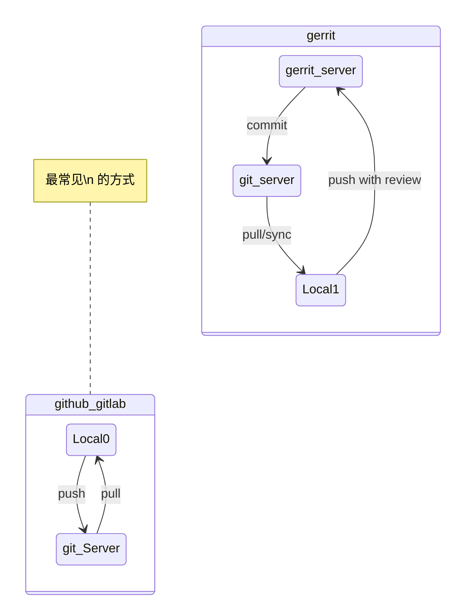

# 什么是Git？

[toc]

## Git 的由来
大家都听说过Linux， Linux 作为最成功的开源操作系统内核，吸引了众多的开发者的青睐。 因此整个项目组从2002年开始启用分布式版本控制系统 BitKeeper 来管理和维护代码。 BitKeeper 由 BitMover 公司开发，该公司 CEO Larry McVoy 与 Linus 曾是好友， Larry 说服 Linus 在内核开发中使用BitKeeper。而 BitKeeper 在免费使用的许可证中加入很多限制条件，惹恼了内核开发者，同时该公司收回了免费使用 BitKeeper 的权力。 最终促使Linus 开发出了毁灭 BitMover 的 Git。

面对如此庞大的 Linux 内核代码，需要用一个什么样的工具来管理代码，Linus 是非常清楚的，毕竟实践过知根知底，所以 Git 在设计就考虑 代码管理中的种种问题。 得益于 Git 的优秀， Git 成为了世界上最流行的代码版本管理软件。

当然不是说Git一定是最好的版本管理软件，针对不同的需求，也有各种不同的版本管理工具。比如二进制大文件的管理，git就不是很适合。

## Why Git？
>如果你还在不停的复制文件，不停的备份，不停的去删除后同步。更改代码之后，又用去比对更改合并。如果遇到代码冲突更是不知所措，那么你可能还在使用非常非常原始的方式或者使用SVN 的思维在工作。

相比其他集中式的版本管理软件，如 SVN必要进行联网才能操作。 git 作为一个分布式版本管理软件，几乎所有的操作都是在本地执行的。本地磁盘中就保存了整个仓库的历史更新记录等，因此，处理速度飞快。

当然，仅仅是分布式是不够的，git 还提供了很多理念和操作， 可以让更多的人参与到代码管理中来，对分支的管控和冲突的处理是非常友好的。但是很多理念虽然先进，但是不符合普通人的思维，这也导致git相比其他会有一个比较陡峭的学习过程。

## 和git的相关的一些概念
没接触或者新接触Git的人，可能一下子不知道Git 是什么。以及和 github、gitlab 之间什么关系？

- **git** 是一个代码版本管理系统的称谓。
- **git** 也是git这个版本管理系统的实现（就是我们理解的软件程序）。比如我们在shell 中敲打`> git `就是执行这个程序。
- **github** 是世界上最大的使用git作为版本管理的服务器。 github本身不开源，但是很多优秀的开源代码都托管在github上面。 另外，github 对开源软件、个人仓库和小团队仓库是免费的。
- **gitlab** 是世界上最流行的使用git作为版本管理的远程服务器开源软件。 gitlab 本身也是一个网站，有点类似github，同时 **gitlab 本身就是开源**的。因此很多公司都采用 gitlab 部署公司内部的软件版本管理系统。 比如我们公司部署的 [http://aszgitlab01/](http://aszgitlab01/)。
- **gerrit** 是一个Google 开发的基于git的开源代码评审管理系统。主要是为了给 Android 仓库进行管理的，本质也是一个git服务器，只是他加了一个中间件用来做评审，只有评审通过的才可以真正的入库。可以观看图片。
    >另外，Gerrit 还配合`repo` 工具进行结合实用。因为 Android 系统的很多组件是单独的仓库，并通过不同的分支进行区分版本。用 `repo` 工具更好的批量操作和管理某一个版本的代码。

*图: github/gitlab 和gerrit 的区别*

## 如何更好的入门和使用git？
git 本身是一个非常强大的系统，但是作为普通用户的我们，其实用到的功能并不多，同时我们的代码也不是异常庞大，协作的人少，因此很多简单命令就可以解决。而对于一些比较高级的操作，也有我们的 CI 工程师帮我们配置好了。

因此，我们只需要对git的概念有了基础的掌握之后，学习几个常用的操作，就可以很好的完成代码管理的工作了。

另外，git 是一个命令行程序。 不过市面上有很多GUI 程序通过封装git 等，做成一个界面版的版本管理软件。

如果你在知道了git的用法之后，在使用git GUI 进行配合，可视化的，还会让你更加直观、直接的进行代码管理，做到事半功倍。说一句真香不过分。

