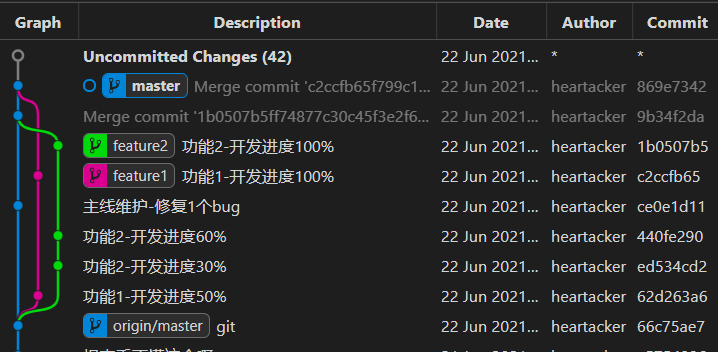

# 1. Git 的一些基础概念、工作区、工作流

[toc]

## 1.1. 如何开始学习 git

想要学习git的话，网上有一大推资料。 非常方便的可以学习。 本人曾经也是什么都不懂得菜鸟。 学习了很久的git，才明白了什么是git，git 该如何使用。 正是因为自己的陡峭的学习经历，才知道作为一个初学者，如果去学习，如何去入门，如何去快速掌握必要的技巧以及使用什么工具可以更快的完成工作。 [网上的快速入门指南](https://www.runoob.com/manual/git-guide/)。

## 1.2. git 的基础概念（务必掌握）
掌握一下几个概念，对使用git的非常有用。

### 1.2.1. git 的工作区概念
git 有三比较特殊的概念，分别是工作区，暂存区和版本库。

- **工作区**:也就是我们通常看到的目录和文件。我们把这个目录和文件看做是工作区域。 在这个文件夹内，可以看到有一个 `.git` 的文件夹（有可能是隐藏的文件夹）。里面保存了所有的和当前工作区相关的git的配置和文件。

- **暂存区**: 暂时可以先把当前的改动保存下来。 英文叫 stage 或 index。一般存放在 .git 目录下的 index 文件（`.git/index`）中，所以我们把暂存区有时也叫作索引（index）。

- **版本库**: 代码改动等真正被存在到数据库之后的地方。里面记录了所有的改动和相关的信息。也是存放在 `.git` 文件夹中。 每一个改动都会有全宇宙唯一的hash码对应记录。

工作区里面被修改的文件需要添加之后才会存储到缓存区，缓存区之后进行commit。才会真正的被记录。svn等系统是没有这个概念的。

### 1.2.2. git 分支概念
几乎每一种版本控制系统都有分支的概念。使用分支意味着你可以从开发主线上分离开来，然后在不影响主线的同时继续工作。

举个非常简单的例子。在某个节点上，产品要求新增了两个功能需求，开发改动可能比较大，分别给两个程序员进行开发。那么这两个程序员就可以在当前的节点的基础上，进行开发。 同时主线上还能进行一些简单的 bug 维护。那么我们可以模拟以下的情形。

图：使用分支进行功能开发

从图中可以看到，我们在主线（`master`）修复了一个bug，同时，我们的**feature1**、和**feature2** 也开发完成，之后 feature1 和feature2测试通过之后，我们就可以把这个分支的提交合并到主线（`master`）中。

很重要的一点，就是，在使用分支开发中。主线做什么操作和分支之间是没有什么关系的。都是独立的操作。

>**但是**，需要注意的是，我们的工作区只有一个（就是我们的文件夹下面的文件在确定的时间内只有一份）。我们需要保持工作区的干净。才能却换到不同的分支。
比如我在`feature1`开发中，我开发到一半，还没来的及提交，忽然上头要求我尽快修复一个bug，那么就需要立马切换`master`分支。这个时候工作区就存在我还在开发中的文件，这就算不干净的工作区。就无法切换到`master`,那么就需要先**暂存** 起来才能切换，这个后续有技巧教学。

> 例外：*未跟踪的文件或者所做的修改* **在分支切换中如果没有冲突**，也是可以切换成功的。

### 1.2.3. 远程的概念
git 脱离网络也可以单独的工作，这是和很多集中式的svn之间最大的区别。 因此没有网络，也可以进行版本管理。git 会记录所有的改动，并以唯一确定的的方式保存在数据库中，等存在网络的时候，再进行处理也不迟。

>如图，我在开发`feature1`/`feature2` 等过程中，我在没有网络的情况下也可以开发，不同的几个节点记录了我当时的改动，这些都是本地的。等有了网络，我就可以将这些记录同步到远程仓库里面去。而svn就无法做到这一点，git 可以提交10次之后在同步到远程，而svn每次提交都必须联网。

当然，git 也是需要网络才能更好地进行团队协作的。本地仓库是一个完整的仓库，如果有网络并存在一个远程服务器，我们就可以把本地仓库关联到远程仓库，后续只需要这个远程仓库，我们就可以和团队协作起来。

但是需要区别 SVN 等，远程仓库其实算是本地仓库的镜像。存储的内容几乎是一模一样的。

查看[[图：使用分支进行功能开发]],我们可以 看到在最下面中节点中显示的是：`origin/master`， 而最新的节点是`master`。这里表示的意思是，`master` 这个分支的远程的节点还在最下面的这个节点中。而本地的节点，已经到了最新的节点了。 远程和本地暂时还没有同步。

其中这个`origin`就是远程仓库的名字。对应的其实是一个网址。

## 1.3. git的工作流

记住以上的几个概念，我们再来看看使用 git 进行代码管理的普通工作流。

在这个图中，我们把本地仓库叫做副本，也来自远程仓库`clone`下来的（图中的【资源库】）， 这也许更加符合我们的的工作场景。

1. **克隆操作** 将远程的仓库克隆下来。 使用 `git clone` 命令。这个工作副本，也就是我们在电脑中看到的工作区。
2. **更新操作** 如果远程有更新（如其他人更新并上传了代码），那么可以通过 `git pull` 拉取最新的代码。其实也算是 *修改工作区*。
3. **修改工作副本** 对工作区进行操作。如编辑、添加、删除文件。就是在修改工作区。当然更新操作也算。
4. **检查修改** 当代码修改好或者调试好之后，我们就check一下都有哪些改动。 确定改动的地方。我们可以通过`git add filename.ext` 将文件添加进来。这个步骤叫做add，也可以叫做检查。
5. **提交修改** 当我们检查完了（也就是`add`）好了之后，我们就把添加评论信息了。
6. **推送操作** 我们提交到本地的仓库之后，那么本地会记录所有的更改。我们可以用`git push` 推送到远程仓库里面去。
7. **修改错误** 在第5步之后，发现如果我们少改了或者改错了，或者少添加了某个文件，我们还可以重新修改这个提交。使用 `git commit --amend --no-edit` 命令可以修改当前的修改。后面有教程会讲解这个。

我们的工作，也就是按照这几个步骤下来。

