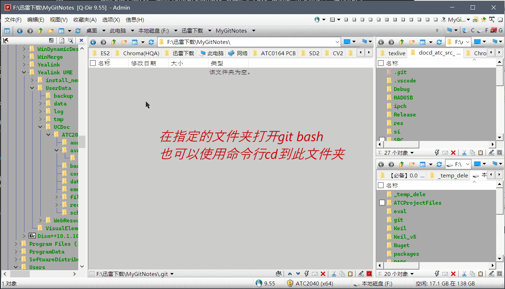
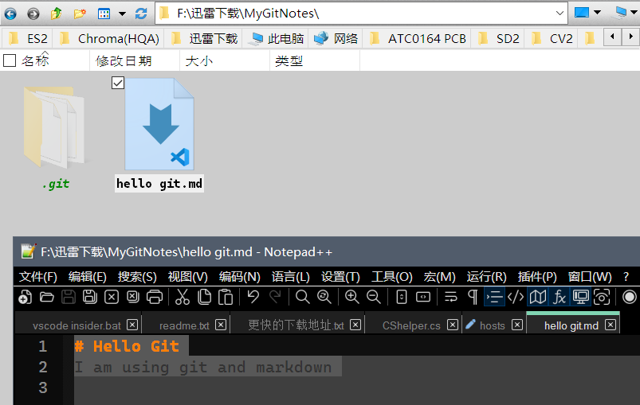
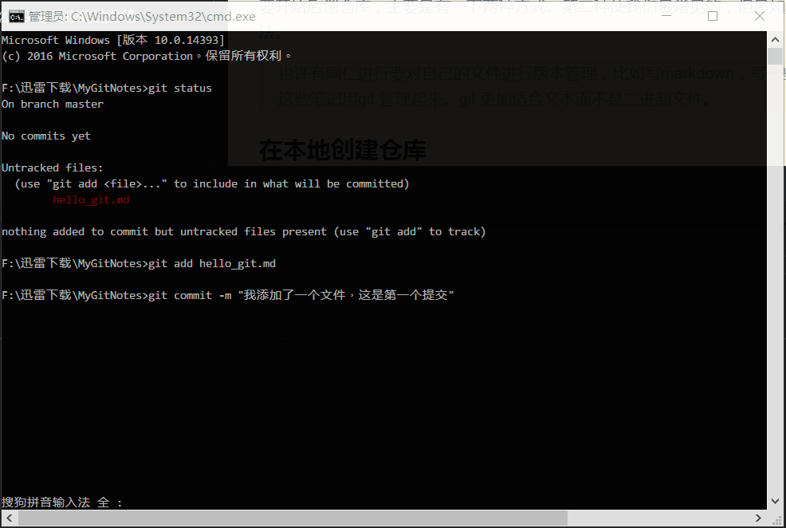
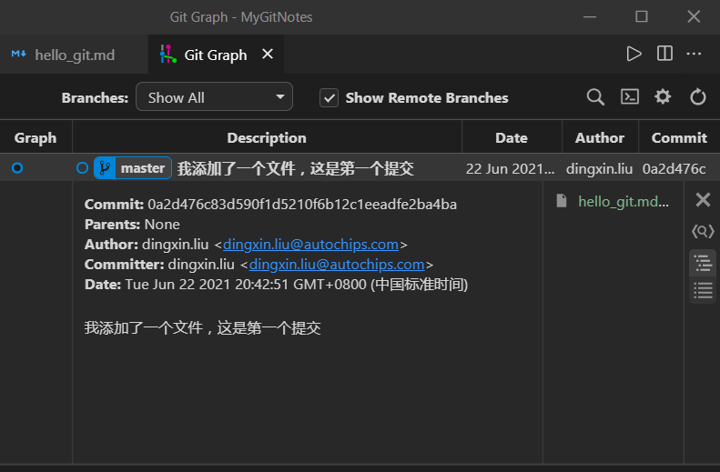
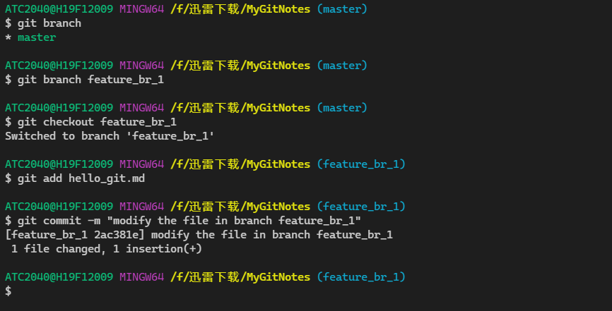
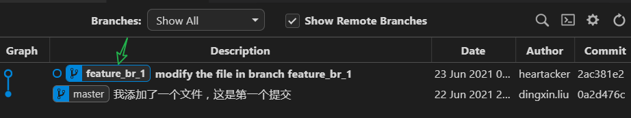

<div align=center>

# 1. Git 的一些基础命令
</div>

[toc]

通过前面的两个文章的讲解，也许大家应该对git的基础使用有了一定的了解。
那么今天就来学习 git 最基本的几个命令。这几个命令也许占用了git的使用的 90% 的时间。

参考连接：[图解Git](http://marklodato.github.io/visual-git-guide/index-zh-cn.html)

大家只需要按照以下的命令，按部就班的进行简单的操作，就可以创建一个仓库并执行第一个提交。

这里先做一个汇总。

| I.e. | Discretion       | command                                                    |   |
|------|------------------|------------------------------------------------------------|---|
|      | **基础操作**     |                                                            |   |
| 0    | 转到指定的路径   | `cd MyGitNotes`                                            |   |
| 1    | 创建或者克隆     | `git init`  或者 `git clone [gitlink]`                     |   |
| 2    | 修改工作区       | 编辑文件，增加文件、删除文件。 以添加一个 `hello_git.md` 为例 |   |
| 3    | 查看工作区的状态 | `git status`                                               |   |
| 4    | 添加到暂存区     | `git add hello_git.md`                                     |   |
| 5    | 提交到仓库       | `git commit -m "我添加了一个文件，这是第一个提交"`          |   |
| 6    | 查看提交记录     | `git log `                                                 |   |
|      | **分支操作**     |                                                            |   |
| 7    | 创建分支         | `git branch name`                                          |   |
| 8    | 切换到分支       | `git checkout name`                                        |   |
| 9    | 创建并切换       | `git checkout -b name`                                     |   |


## 1.1. 创建命令/克隆命令
要开始后创仓库，主要是有一下两种方式。第二种使我们最常见的，但是如果你有自己的代码需要版本管理，那么可以使用第一个方法。

> 也许有同仁进行要对自己的文件进行版本管理，比如写markdown，写一些学习代码。或者做一些其他笔记。那么你完全可以将这些笔记用git 管理起来。git 更加适合文本而不是二进制文件。
### 1.1.1. 在本地创建仓库
使用
```bash
> cd some_folder
> git init 
```
就可以把 some_folder 初始化为本地的仓库。
如我在本地创建一个 `MyGitNotes` 的文件夹。我开始用这个文件夹进行管理。


### 1.1.2. 克隆已经存在的仓库
复制仓库的的连接并使用clone的命令进行clone。
```
> git clone http://some.webgit.com/user/projectname.git
```
## 1.2. 修改工作区文件
可以：添加文件，删除文件，修改文件。

这里添加一个`hello git.md` 文件。



## 1.3. 查看工作区的状态
使用`git status` 可以输出当前工作区状态，会发现有一个未跟踪的文件。

```bash
F:\迅雷下载\MyGitNotes>git status
On branch master

No commits yet

Untracked files:
  (use "git add <file>..." to include in what will be committed)
        hello_git.md

nothing added to commit but untracked files present (use "git add" to track)
```

## 1.4. 添加修改到暂存区
使用 `git add file` 到暂存区。
这里我使用
```bash
> git add hello_git.md
```

## 1.5. 提交修改
使用 `git commit`的命令提交修改。这里使用：
```bash
> git commit -m "我添加了一个文件，这是第一个提交"            # 将暂存器的文件存放到仓库中。
```
## 1.6. 查看log



## 1.7. 使用GUI 看到的log



## 1.8. 创建分支/切换分支/分支操作

如图： 创建并切换到 分支 `feature_br_1`,修改文件并添加然后提交。



可以看到，创建一个分支并切换到那个分支之后，操作和最开始的基础操作无差异。

效果：



