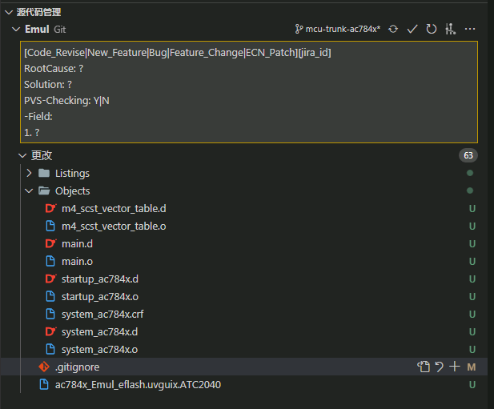
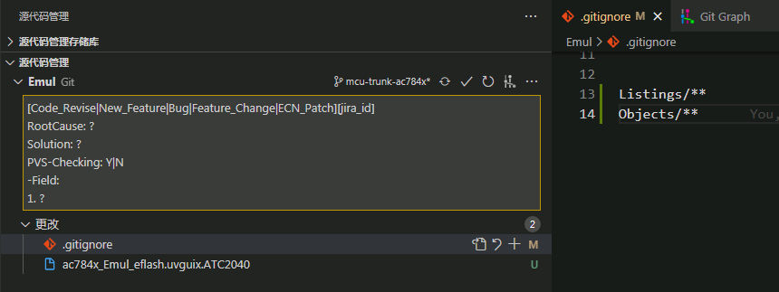
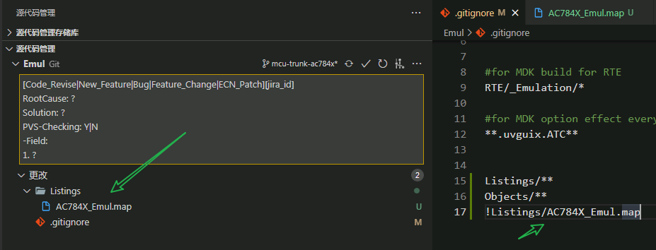

<div align=center>

# 1. Git 如果忽略某些文件
</div>

[toc]

## 1.1. 为什么会这样？

git 把一个文件夹当做工作区。那么默认下，会监控当前文件夹下面的所有文件。 这就很烦恼了。
比如，我们在监控 keil 的工程的时候，我们会生成很多临时文件，如下图中的: `Listings`  和 `Objects` 文件夹，这些文件根本就不关心的，结果又在版本管理中出现，严重影响用户进行管理，毕竟这些不关心的文件对用户形成了干扰。



## 1.2. gitignore文件

这个时候， `gitigonre` 文件应运而生。 它是一个文本文件，记录了当前仓库中，哪些文件可以不关心，哪些文件需要特别关心。


以上述两个文件夹为例，我们可以忽略它。

那么只需要在 `.gitigonre` 里面添加：

```ignore
Objects/**
Listings/**
```
从下图可以看到，添加了之后，就不会有这些烦恼的问题了。




## 1.3. 通配符
但是，你会发现，还是有一个其实也不关心的`ac784x_Emul_eflash.uvguix.ATC2040`, 而且还和特定的 `ATC2040`有关系。 也就是说我编译了一次。就会生成当前计算机用户名的为后缀的文件。

这个难道每个人都要添加一个到 `.gitignore` 文件中。

其实 `.gitignore` 支持通配符。添加以下通配符就可以
```
**.uvguix.ATC**
```

这样就可以统配到这个无关紧要的的 `uvguix` 文件了。

## 1.4. 如何跟踪忽略文件夹里面的特定文件？

在 `Listings` 文件夹中，我们发现有一个文件是特别有用的。比如 `AC84X_Emul.map`,假定这个文件特别重要，那么我们可以添加一下命令取消忽略。我们只需要在前面添加`!` 就可以 强制忽略了。

```
!Listings/AC84X_Emul.map
```
图示：




这些都是基本用法。其实很简单。但是就是没有人去关心而已。


**更多的用法。可以参考其他书籍或者根据特定的情况下去查资料就好。**