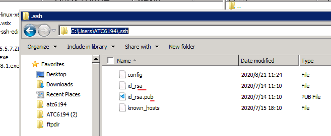
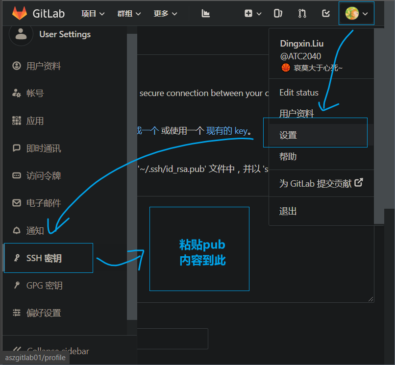
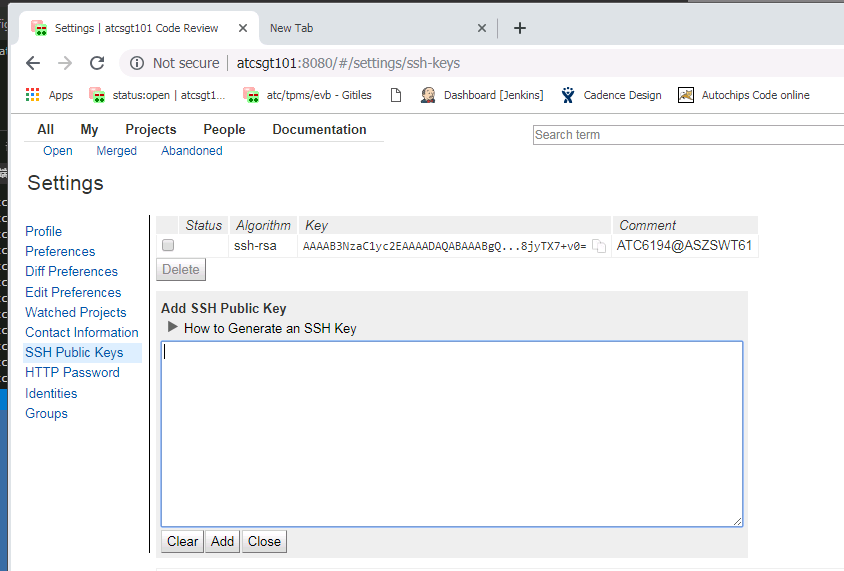
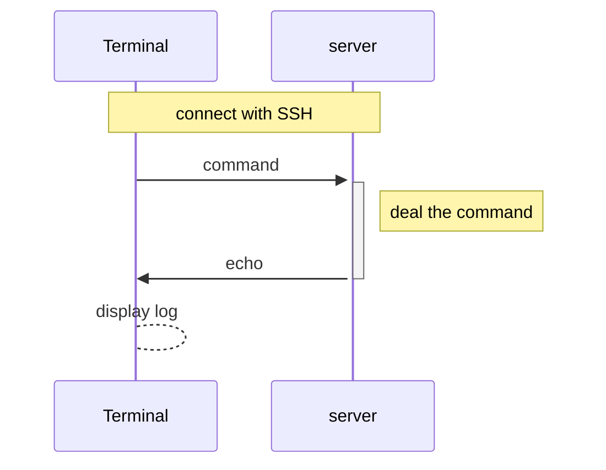
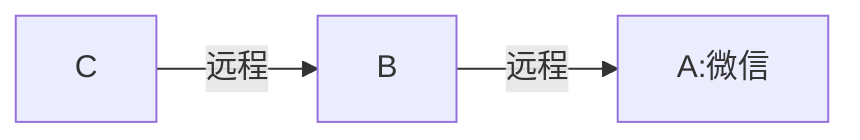
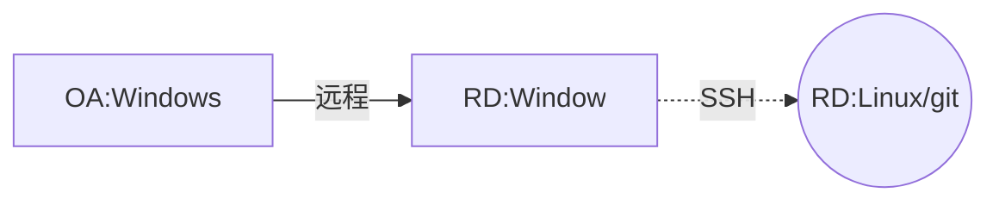
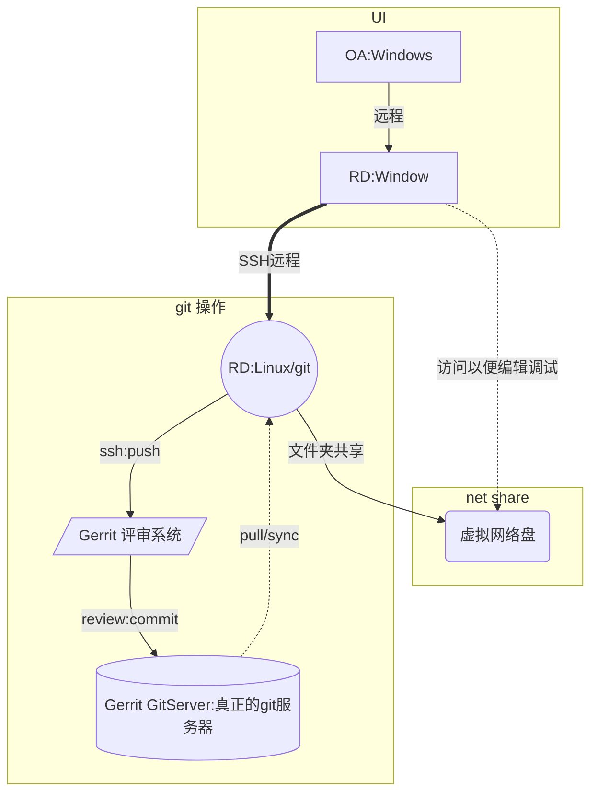
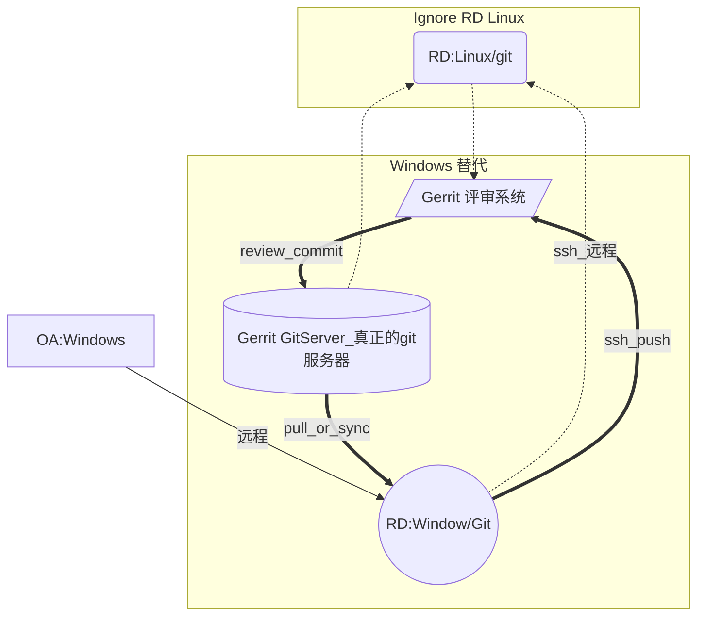

# 1. git的远程分支和认证

[toc]

## 1.1. 远程服务器
目前我们使用到的 Git 命令都是在本地执行，如果你想通过 Git 分享你的代码或者与其他开发人员合作。 你就需要将数据放到一台其他开发人员能够连接的服务器上。

之前说过， [github](https://www.github.com) ， [gitlab](https://www.gitlab.com) 等等就是我们常说的远程服务器。公司内部也有自己搭建的 http://aszgitlab01/ 服务器。 然后 RD 环境中使用的 [gerrit](http://atcsgt101:8080/)  也是远程服务器之间的一种。

- [github](https://www.github.com) 最大的开源代码共享网址 。
- [gitlab](https://www.gitlab.com) 最大的开源git服务程序和网址 。
- http://aszgitlab01/ 杰发内部的gitlab服务器 。
- [gerrit](http://atcsgt101:8080/) 杰发内部 RD 环境中的 评审系统。主要服务于 Android。

我们可以将本地的 仓库和远程仓库关联起来，实现远程同步和协作。

## 1.2. 连接认证
安全的网络连接都需要网络认证。 就像你使用百度网盘需要登陆账号一样。
 git 支持多种认证方式。 包括 `ftp`/`http`/`https`/`ssh`。
 支持最好的是`ssh`，而且很多网络终端通信也是使用`ssh`的，比如终端连接 Liunx。

下面以内部的 gitlab 服务器为例，尝试设置 OA 端和 gitlab之间的连接。这个大家已经很熟悉了。其实很多地方都是这样用的。

### 1.2.1. 生成 SSH 
> 可以现在用户文件夹下看看能否看到`.ssh` 文件夹以及里面是否存在 已经生成好的公、私钥。
1. 打开git-bash
2. 生成ssh 公私钥，执行这个命令，`$ ssh-keygen -m PEM -t rsa`
    这样，你就会在windows 用户文件夹下面看到这些文件。
   - 其中一个是*公钥* `.pub` 结尾的。 可以公布给别人。
   - 其中一个是*私钥* `id_rsa` 。 务必不要泄漏。 
   

### 1.2.2. 配置 SSH
1. http://aszgitlab01/ 打开 gitlab 网站，并在设置中找到ssh 配置。
   
2. 复制`~/.ssh/rsa.pub` 里面的内容.
3. 配置完毕.

### 1.2.3. RD windows 下访问 gerrit
1. 在RD 端打开gerrit 网址,并登录 atc gerrit 网站,找到setting 并进入ssh设置
   
2. 配置流程和上述一致，之后就可以进行通信。

## 1.3. 疑难解惑

### 1.3.1. 终端 通过 SSH 连接 Linux 是怎么一回事？

终端，`Terminal` 对于很多人来说是熟悉又陌生。 关于为什么叫做`Terminal` 是有历史的。 

一台大型主机往往需要支持许多用户同时使用，每个用户所使用操作的设备，就叫做Terminal——终端，终端使用通信电缆与电脑主机连接，甚至可以通过电信网络（电话、电报线路等等）连接另一个城市的电脑。[终端、Shell、tty 和控制台（console）有什么区别？](https://www.zhihu.com/question/21711307)

终端这个名字沿用至今， 现在一般是一个软件。 主要通过 网络 进行和主机通信，而通信其实是通过 ssh 协议加密的。 关于 【非对称加密】，可以自行百度。

### 1.3.2. 我们的工作用的 RD Linux 究竟是服务器吗？
我们部门使用 RD 的工作环境进行开发。我们先用我们的OA 电脑远程 RD的 Windows 桌面系统，然后在用 RD 的windows 通过 **puty** 等连接到RD linux，然后在操作 git。

那么这么折腾的层层连接，我们的RD linux 对于git来说，究竟是`git服务器`还是`git客户端`？

那么我们这样理解，我在`A` 电脑安装 微信客户端。 然后用`B` 远程 `A` 电脑。然后在用`C` 远程`B` 电脑。那么我们的  `A` 电脑微信是客户端还是服务端？

显然，A 电脑依旧是微信的客户端。而不是微信的服务器。微信的服务器在腾讯那儿呢。

所以，对于git而言。

所以，RD:Linux 还是git的客户端。

可能是这个虚拟盘大家觉得RD linux 是一个服务器吧，其实他也是一个用户端，只是这个用户端是 Linux 的系统罢了。

### 1.3.3. 为什么我们一定要用 Linux？

其实无非就是IT 按照现在的方式，方便管理git，所以就用Liunx。尤其是 Android的开发需要用到 `repo` 工具。

但是开发 TPMS/MCU 基本都在Windows 下。毕竟大家都用 Keil 这个工具链。 所以 IT 就把这个代码文件从 Linux 中 共享出来，让我们的Windows可以访问并且编辑、编译、调试罢了。说实话速度慢的很。 

### 1.3.4. 可以直接用RD Windows 进行管理吗？
毕竟写代码。编译。调试等等都在 Windows，而且使用共享盘是非常慢的。

答案是**可以的**。 毕竟使用 keil 不像 Android 的管理那样频繁的需要使用 `repo`。
只要把各个模块的仓库`clone` 下来之后，之后正常的在Windows 下操作就好了。不过可能要添加一些小配置。

之后的效果：

