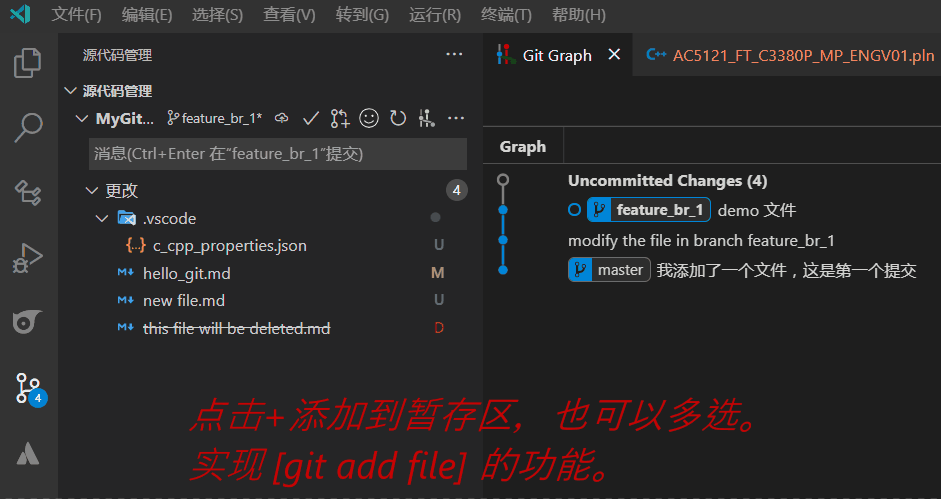
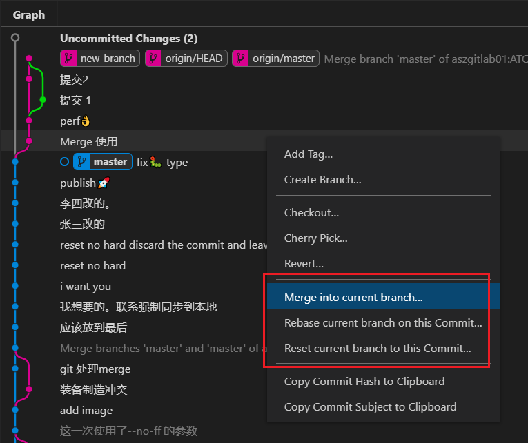

<div align=center>

# 1. Git-GUI 使用VSCode操作git(常用，务必学习)

</div>

[toc]

## 1.1. 为什么git GUI 我选择VSCode？

之前说过，所有 git GUI 相关的程序其实都通过封装 原始的 git 去实现的。 市面上有很多类似的管理程序。但是为什么选择 VSCode，难道是VSCode 专门为git 特别优化和定制了相关功能？

其实不是，VSCode 其实只是一个编辑器。但是他内置了对 git 的支持。而且支持的非常 优秀。但是，这还只是 VSCode 其中的一个简单的功能而已。VSCode 还有更多强大的功能，比如最基础的代码对比，  那何乐而不为嗯？ 就像买手机一样。能打电话只是其中一个基础的功能罢了。

## 1.2. 主要特性

VSCode 有版本管理的 API。因此其他版本管理软件很容易就可以集成到VSCode。如 `git` `svn` 等版本管理软件都是支持的。 当然，VSCode 内置了对 git的支持。 如果想支持 `SVN`， 只需要安装扩展就可以了。


从这个图可以看出来。

- **仓库管理区**: 识别并将所有的仓库列出来。
- **源代码管理区**: 很方便的就把工作区的状态显示出来。
  - **工作区** 更改（edit）的文件一目了然。
  - **暂存区** 添加了（add） 的文件也非常清晰。
  - **提交栏** 直接编写 comment 就可以commit。
  - **分支栏** 支持快捷操作切换等
  - **同步纽** 方便同步代码。
  - **菜单栏** 方便进一步的操作。
- **代码对比和编辑**:方便对比工作区或者暂存区的代码。方便快捷。
- **终端区** 如果实在不习惯gui的 可以直接在终端中新建一个git-bash 直接敲打命令。
- **高级视图** 安装插件可以更方便的进行对比。
- **其他高级操作** 比较少用，但是用的时候就很方便。安装插件就可以实现。

基本上一站式解决代码管理的问题。

## 1.3. 推荐的VSCode 插件

OA 端可以在 商店直接安装。
如果在RD 可以下载离线安装包拖放到VSCode 中进行安装。

### 1.3.1. gitlens

安装量最高的 git 插件，安装量达到 950 万。

> 增强Visual Studio Code中内置的Git功能——通过Git责怪注释和代码镜头直观地看到代码的作者，无缝地浏览和探索Git存储库，通过强大的比较命令获得有价值的见解，等等。

```json
名称: GitLens — Git supercharged
ID: eamodio.gitlens
说明: 增强Visual Studio Code中内置的Git功能——通过Git责怪注释和代码镜头直观地看到代码的作者，
无缝地浏览和探索Git存储库，通过强大的比较命令获得有价值的见解，等等
版本: 11.5.1
发布者: Eric Amodio
VS Marketplace 链接: https://marketplace.visualstudio.com/items?itemName=eamodio.gitlens
```

### 1.3.2. Git Graph

安装量最三高的 git 插件，安装量达到 130 万。 此插件非常直观的查看提交记录，并提供方便的快捷菜单用来到指定的节点指定的操作，比如 `reset` `revert` `merge` `rebase`等等。


> 查看存储库的Git图，并从图中执行Git操作。

```json
名称: Git Graph
ID: mhutchie.git-graph
说明: View a Git Graph of your repository, and perform Git actions from the graph.
版本: 1.30.0
发布者: mhutchie
VS Marketplace 链接: https://marketplace.visualstudio.com/items?itemName=mhutchie.git-graph
```

## 1.4. VSCode 对这些命令是如何支持的？

VSCode 提供简单的按钮和菜单来集成对git的支持。如果你事先对git有一定的了解，那么你一定会得心应手。 **但是如果你对git不清楚的，那给你最优秀的体验你也是云里雾里**。

`<font color=purple>`不过不用担心，遇到任何问题，都可以去网上查找资料或者咨询别人，相信很快就可以找到问题的答案和操作方法。`</font>`

> **对于任何操作，当存在冲突的时候，VSCode 都会进行提示。所以除非自己强制去操作，否则不用担心数据被弄乱和丢失。**

### 1.4.1. add /reset file、检查、添加、撤销

如图操作: `git add hello_git.md` 和 `git reset hello_git.md`



### 1.4.2. commit、提交

如图操作：实现 `git commit -m "修改文件"`


### 1.4.3. amend、修改上一个提交

如图操作：实现 `git commit --amend --no-edit`


### 1.4.4. branch、分支创建、却换分支

如图操作：实现 `git branch branch2` 并切换到 `branch2`。


### 1.4.5. fetch、查询远程的最新更改


### 1.4.6. 远程推送（上传 push）/ 拉取（pull）最新


当然可以直接选择更方便的 `sync`(同步功能)。

## 1.5. sync、同步功能

> **声明** git 和 svn 不一样，git 是没有同步（sync）的功能的。

我们把同时进行 `拉取+上传（pull + push）`叫做 `同步（sync）`。

当点击VSCode的同步按钮的时候，他会自动处理。

当远程和本地工作区存在冲突的时候，他会提示用户去处理冲突。（关于merge 和rebase的区别是什么？后续会讲解）

| 上传 | 下载 | 冲突 |      同步作用      | 处理方式                                                                 | Cmd                                                   |
| ---- | ---- | ---- | :-----------------: | ------------------------------------------------------------------------ | ----------------------------------------------------- |
| √   | 0    | ×   |      `push`      | *                                                                        | `git push`                                          |
| 0    | √   | ×   |      `pull`      | *                                                                        | `git pull`                                          |
| √   | √   | ×   |  `pull`+`push`  | 自动进行 merge/rebase                                                    | `git merge 远程/分支</br>` `git rebase 远程/分支` |
| √   | √   | √   | `pull`+?+`push` | merge/rebase，`</br>`然后`<font color=Red>`提示去处理冲突`</font>` | `git merge 远程/分支</br>` `git rebase 远程/分支` |

## 1.6. 合并（merge）、变基（rebase）和挑拣 （cherry-pick）

可以通过 git graph 快捷操作。



## 1.7. conflict、冲突解决

只要在 `merge`、`rebase`、`pull`、`push` 等等的情况下，都会有冲突产生。
无论是从其他分支合并过来还是从远程分支合并过来。本质都是一样的。

- 那么这是一个很简单的git 远程和本地存在冲突的处理方法。 方式为`merge`


- 下面是一个 git 远程和本地存在冲突的处理方法。 方式为`rebase`


> 关于vscode 默认是merge 还是 reabse 可以通过配置进行设置。后续会有详解。

## 1.8. 总结

通过几个简单的学习，很快你就可以学习到最基本的操作，GUI 主要是更加直观和清晰。如果你是在是不喜欢GUI 的形式。VSCode 的终端适合你敲命令。
