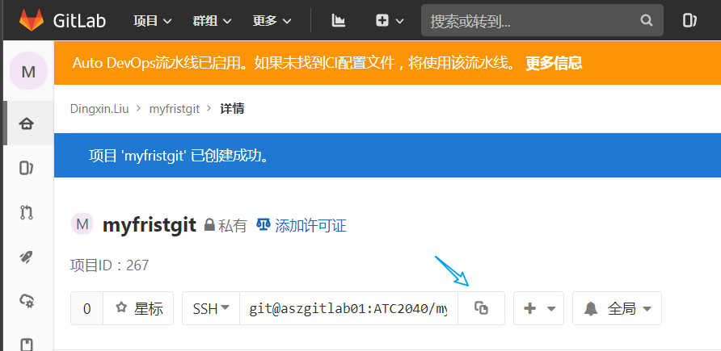

<div align=center>

# 1. Git-lab 进行一次完整的练习【基础完结】
</div>
[toc]

## 1.1. 学习建议
通过前面的几个章节的学习。其实大家用听起来还是很模糊的。根本不知道这是什么？

那么本宫强烈建议你学习使用 gitlab 进行尝试一下。公司也有 gitlab 可以供给大家使用。而且每个人都有账号权限。

我们开始吧。

## 1.2. 准备步骤

### 1.2.1. 安装 git 客户端


参考： [00. git Windows 客户端 安装 - SOP(System) - WIKI (autochips.inc)](http://wiki.autochips.inc/pages/viewpage.action?pageId=68059864)

### 1.2.2. 安装 VSCode


参考： [00. git Windows 客户端 安装 - SOP(System) - WIKI (autochips.inc)](http://wiki.autochips.inc/pages/viewpage.action?pageId=68059864) 

注意，顺便安装一下 gitlens 和 git graph 这两个插件。


**准备完毕。 恭喜你。**
## 1.3. 简单配置
### 1.3.1. 登录你的 gitlab 账号

登录地址： [Sign in · GitLab](http://aszgitlab01/users/sign_in) 输入你的账号


### 1.3.2. 创建你的 ssh 公、私钥并配置到 gitlab 中

参考：[05. Git 的远程分支和 SSH 认证、gerrit 如何设置 免密 - SOP(System) - WIKI (autochips.inc)](http://wiki.autochips.inc/pages/viewpage.action?pageId=68060280#id-05.Git%E7%9A%84%E8%BF%9C%E7%A8%8B%E5%88%86%E6%94%AF%E5%92%8CSSH%E8%AE%A4%E8%AF%81%E3%80%81gerrit%E5%A6%82%E4%BD%95%E8%AE%BE%E7%BD%AE%E5%85%8D%E5%AF%86-1.2.%E8%BF%9E%E6%8E%A5%E8%AE%A4%E8%AF%81)

### 1.3.3. 创建一个 git 远程仓库

创建一个 `myfristgit` 仓库。可以选择私有的。别人看不见哦。


### 1.3.4. 克隆到本地（clone）


复制 仓库连接，使用打开 命令行 并 使用 **`git clone`** 命令克隆

```
PS F:\PersonalFiles> git clone  git@aszgitlab01:ATC2040/myfristgit.git
Cloning into 'myfristgit'...
warning: You appear to have cloned an empty repository.
PS F:\PersonalFiles> code .\myfristgit\
PS F:\PersonalFiles>

```

### 1.3.5. 使用 VSCode 新建 编辑一个文件，并做出一个提交 commit
使用VSCode 打开clone的文件夹。


很简单啊。


### 1.3.6. 远程可以查看记录

点击推送到远程。


## 1.4. 总结
其实按部就班来，非常简单。

|      |                                                                                           |                                                                                           |
| ---- | ----------------------------------------------------------------------------------------- | ----------------------------------------------------------------------------------------- |
| 恭喜 |  |  |


