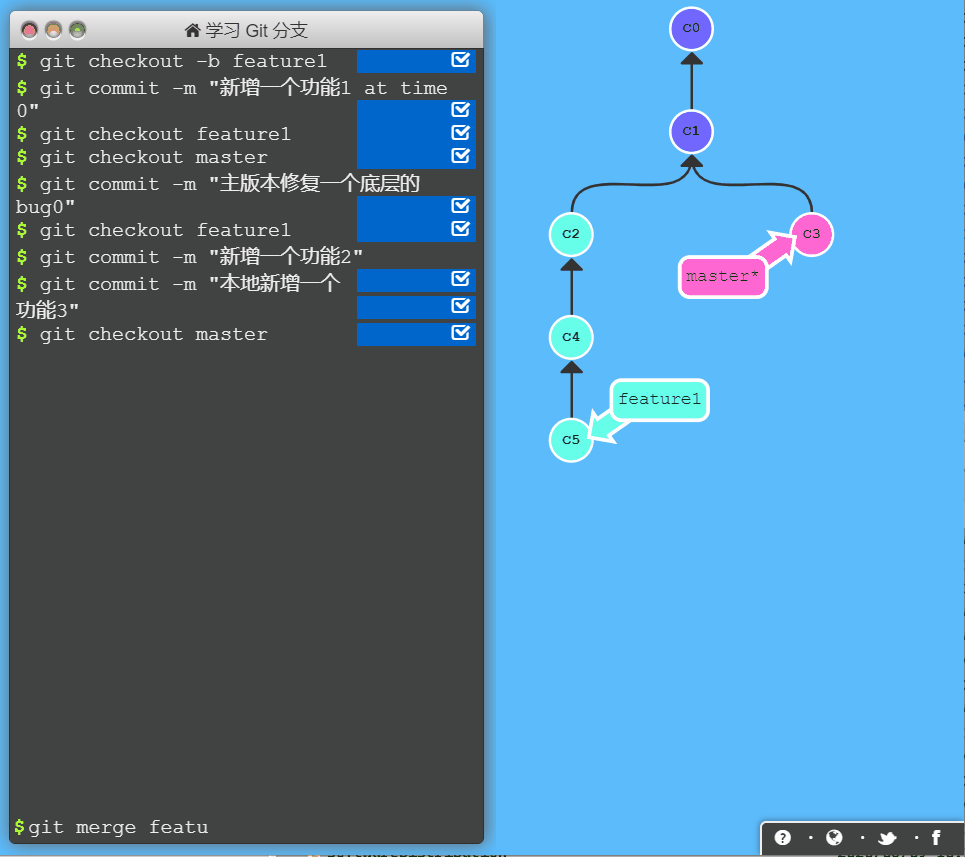
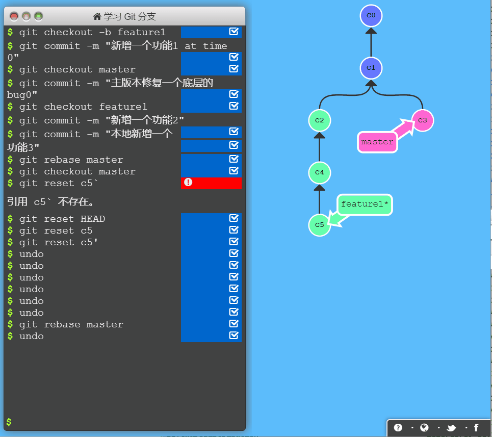
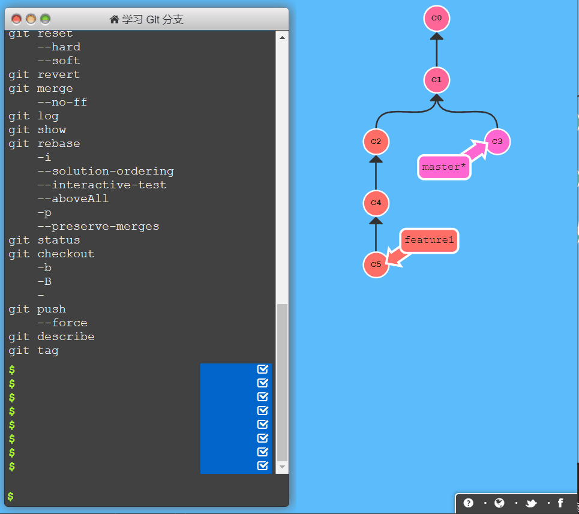
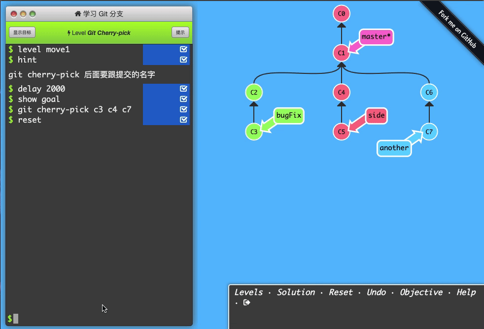

<div align=center>

# 1. Git-GUI 分支合并？ merge rebase cherry-pick 有啥区别？
</div>

[toc]

代码合并在日常开发中是较为常见的场景，采用合适的合并方式，可以起到事半功倍的效果。对应在 Git 中合并的方式主要有三个，`Merge` ，`Rebase`，`Cherry-Pick`. 开始部分会首先介绍一下这三个命令，并录制了一些动画，用于演示三个命令的不同合并过程。之后会实操这三个命令，演示如何解决冲突。

```bash
git checkout -b feature1
git commit -m "新增一个功能1 at time 0"
git checkout feature1
git checkout master
git commit -m "主版本修复一个底层的bug0"
git checkout feature1
git commit -m "新增一个功能2"
git commit -m "本地新增一个功能3"
```
以下动图使用 [git 在线 图示操作网址](https://learngitbranching.js.org/?locale=zh_CN) 结合 Screen2Gif 录制。

## 1.1. merge （合并）
merge 会将两个分支合并到一起，并生成一个新的 commit 记录。新生成的 commit 节点会有两个父节点。一般在开发某个新功能时，会选择新的分支`feature1`，之后在合并回主线`master`。

<div align=center>

**特别提醒，此操作是在 `master` 线分支操作的。**
</div>



## 1.2. rebase（变基）
rebase 也能合并分支，它会取出`master` 中一系列 commit 记录，复制它们。然后在目标分支逐个放下去。rebase 的好处是能保持线性的提交历史，从而使历史更加清晰。

<div align=center>

**特别提醒，此操作是在 `feature1` 线分支操作的。**
</div>



所谓的变基，就是 feature 分支的base之前是`c1`,现在变成了`c3`。

之后。我们合并 `feature1` 到 `master` ， 其实就是一个时间线。 使用reset 就可以将 master 更新到最新的 `c5'`。


## 1.3. merge 和 rebase的区别

1. merge 一般在主线中操作，rebase 在分支中操作比较多。
2. merge 是从别的地方合并过来，形成一个新提交。 而 rebase 一般是合并原始的分支。
3. merge 会多一个提交。 rebase 不会。
4. 在多人**远程**协作作用，更推荐使用 rebase 进行管理。 尤其是 使用 `gerrit` 等评审系统的时候，这样可以提前处理可能潜在的冲突。
5. 在多分支开发中。更推荐使用 merge 方便进行

## 1.4. cherry-pick （挑拣）

`cherry-pick` 而是将`feature1`一些 commit 复制到当前的 `master` 分支的 HEAD 上，和 `rebase` 相比，更加灵活，可以随意的选择 commit 进行复制。

主要用于分支之间差距比较大的场景。如不同的客户定制版本有不同的分支，现在发现了同样的bug，从别的分支中挑选一部分过来。

<div align=center>

**提示：此场景用的，这个比较少用。**
</div>



也可以随意挑拣。



