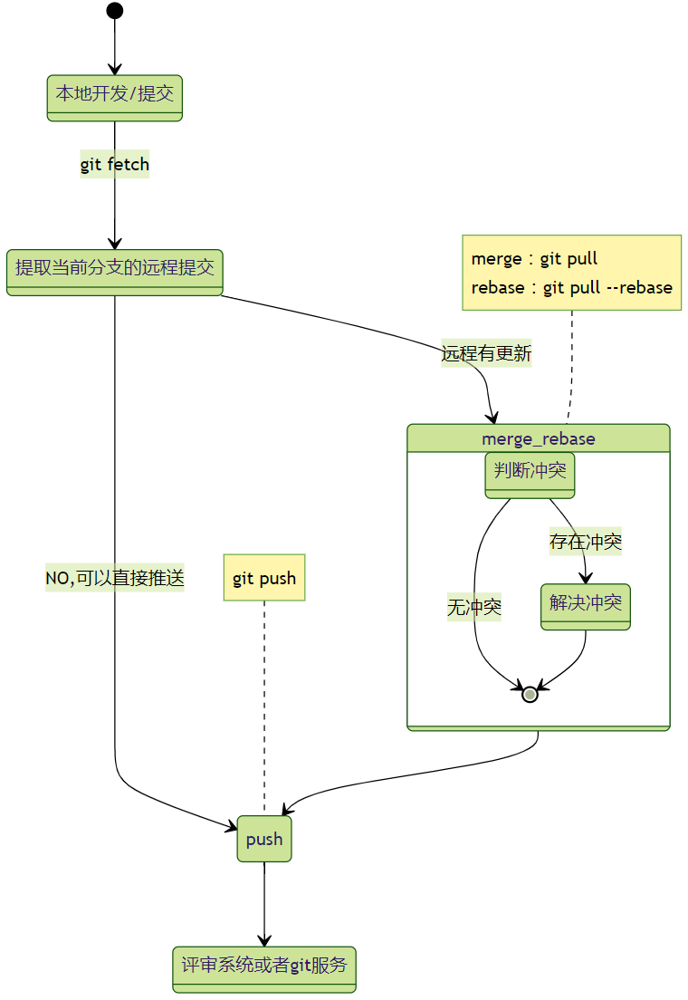

<div align=center>

# 1. 远程分支管理之提取、合并、变基、拉取、推送


</div>

[toc]


为了 push 新变更到远程仓库，你要做的就是包含远程仓库中最新变更。意思就是只要你的本地分支包含了远程分支（如 `o/main`）中的最新变更就可以了，至于具体是用 `rebase` 还是 `merge`，并没有限制。


## 1.1. 远程管理的基本流程。




## 1.2. 操作方式

在讲解操作方式之前，我们来看看 我们常常听到的概念。

另外，是否还记得。之前说的，远程分支其实也是一个分支，和本地分支没有本质区别。只是他是存放在远程的分支而已。

| 名称      | 概念            | 说明                                                                                          |
| --------- | --------------- | --------------------------------------------------------------------------------------------- |
| 提取      | `fetch`         | 从远程仓库提取到**本地仓库**（不是到工作区）。<br>之后使用`merge` or `rebase`命令合并到工作区 |
| 拉取/合并 | `pull`          | 默认等价于： `fetch` + `merge`  提取远程并合并到本地                                          |
| 变基      | `rebase`        | 等价于： `fetch` + `rebase`    提取远程，并将本地rebase到远程                                 |
| 拉取变基  | `pull --rebase` | 等价于： `fetch` + `rebase`                                                                   |
| 推送      | `push`          | 推送本地到远程。  推送之前，建议本地已经更新到远程版本。                                      |
| 同步      | sync            | **git 没有同步功能**，但是VSCode 自动处理 `pull` + `push` 叫做 sync                           |


另外。由于我们常常使用 拉取比较多，也是最简单的方式 ，因此下面我们就只讲解 `git pull` 和 `git pull --rebase`。
大家知道概念就行。

**大家也只需要记住，在当前分支下，使用 `git pull` 和 `git pull --rebase` 就可以了.**

###  1.2.1. merge 等价

```bash
git fetch
git merge remote/branch
```
等价于
```bash
git pull
```

### 1.2.2. rebase 等价
```bash
git fetch
git rebase remote/branch
```
等价于
```bash
git rebase remote/branch
```
等价于
```bash
git pull --rebase
```

## 1.3. 具体操作

### 1.3.1. `git fetch` 远程提取

是否还记着git的工作区概念。包含工作区。暂存区和存储区（本地仓库）。


使用`git fetch` 就是将远程的提交更新到本地的存储区当中。而不是工作区。


### 1.3.2. `git pull` 远程拉取合并

前面我们已经说了， `git pull` 就是 `git fetch` 和 `git merge` 的缩写！

<!--  -->


### 1.3.3. `git pull --rebase` 远程变基

`git pull --rebase` 就是 `git fetch` 和 `git rebase` 的缩写！

<!--  -->


### 1.3.4. `git push` 推送

推送到远程。


## 1.4. 为什么 gerrit 推荐使用 rebase？

那么既然没有规定限制，为何前面几节都在着重于 rebase 呢？ 为什么在操作远程分支时不喜欢用 merge 呢？
因为 reabse 能够更好的整理时间线，尤其是使用 gerrit 的场景。你在修改的时候。其实很多人也在修改远程。但是问题在于推送还需要评审，在没有评审过之前，很难知道是否和远程有冲突。因为评审需要时间，也可能别人在评审之间提交了和你的冲突。

**所以，在使用gerrit中。推荐使用rebase到远程之后才push上去**。


使用VSCode 的同步功能可以很好地设置默认使用 `rebase` 还是 `merge`。 参考连接：


## 1.5. 总结

现在是不是更加容易理解。之前[使用VSCode 操作 git](http://wiki.autochips.inc/pages/viewpage.action?pageId=68060312#id-06.Git-GUI%E4%BD%BF%E7%94%A8VSCode%E6%93%8D%E4%BD%9Cgit(%E7%89%B9%E5%88%AB%E5%B8%B8%E7%94%A8%EF%BC%8C%E5%8A%A1%E5%BF%85%E5%AD%A6%E4%B9%A0)-1.4.6.%E8%BF%9C%E7%A8%8B%E6%8E%A8%E9%80%81%EF%BC%88%E4%B8%8A%E4%BC%A0push%EF%BC%89/%E6%8B%89%E5%8F%96%EF%BC%88pull%EF%BC%89%E6%9C%80%E6%96%B0) 是怎么回事啦？


**注意：**

>图中<font color=red>红色区线条</font>就是本地仓库区，可以看到和远程(`orgin/HEAD`)已经同步了。<font color=#0085d9>蓝色区线条</font>是工作区，和远程之间是有差别的。

>借助 `git graph` 插件，我们可以在<font color=red>红色区域</font>选择右键并直接是进行 `merge` 或者 `rebase`，这样还可以**指定节点**哦。